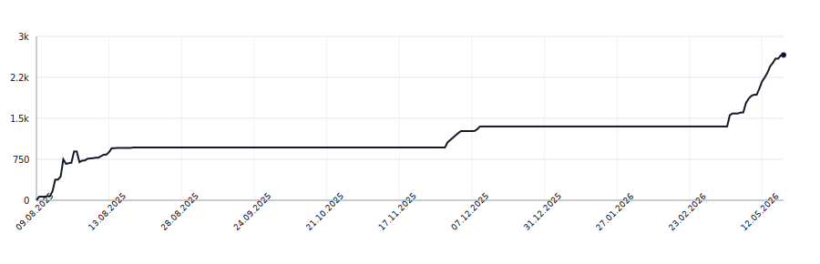

[](https://github.com/apakabarfm/syllabreak/actions/workflows/tests.yml)

# syllabreak

Multilingual library for accurate and deterministic hyphenation and syllable counting without relying on dictionaries.

## Supported Languages

- 🇬🇧 English (`eng`)
- 🇷🇺 Russian (`rus`)
- 🇷🇸 Serbian Cyrillic (`srp-cyrl`)
- 🇷🇸 Serbian Latin (`srp-latn`)
- 🇧🇦 Bosnian (`bos`)
- 🇭🇷 Croatian (`hrv`)
- 🇲🇪 Montenegrin Latin (`cnr-latn`)
- 🇲🇪 Montenegrin Cyrillic (`cnr-cyrl`)
- 🇹🇷 Turkish (`tur`)
- 🇰🇿 Kazakh (`kaz`)
- 🇰🇬 Kyrgyz (`kir`)
- 🇬🇪 Georgian (`kat`)
- 🇭🇺 Hungarian (`hun`)
- 🇩🇪 German (`deu`)
- 🇫🇷 French (`fra`)
- 🇷🇴 Romanian (`ron`)
- 🇪🇸 Spanish (`spa`)
- 🇵🇹 Portuguese (`por`)
- 🇵🇱 Polish (`pol`)
- 🏛️ Latin (`lat`)

## Why syllabification isn't trivial

A few language-specific quirks the algorithm has to encode. Each one would otherwise produce visibly wrong splits.

- **BCMS (bos, hrv, cnr)** — long-jat reflex `ije` is **one** syllable: `mli-je-ko` is wrong, `mlije-ko` is correct. Two graphic-but-not-jat exceptions are `dvije` and `prije` (Matešić 2015, rule P11). `srp-latn` does not encode `ije` because Serbian dictionaries cover both ekavian and ijekavian; pass `lang="hrv"` (or `bos`/`cnr-latn`) for ijekavian text.
- **Montenegrin** adds `ś`/`ź` (Latin) and `с́`/`з́` (Cyrillic, decomposed `с` + U+0301 only — no precomposed Unicode points exist).
- **French** — `eau` is a trigraph vowel: `châ-teau`.
- **Romanian** — final `-i` after a consonant is palatalization, not a separate syllable: `stu-denți`, not `stu-den-ți`. Adjacent vowels split into hiatus: `pri-e-teni`.
- **German** — `st` between vowels splits after a short nucleus but stays together after a long one (`stra-ße` vs `kin-der`-class cases).
- **Latin** — hiatus is mandatory: `po-e-ta`, `phi-lo-so-phi-a`.
- **Polish** — digraphs `sz`, `cz`, `rz`, `dz`, `ch` stay together inside a syllable.
- **Hungarian** — only one consonant moves to the next syllable, so even valid onset clusters split (`ab-lak`, not `a-blak`). Geminate digraphs are written compactly (`ssz`, `ggy`, `nny`, `lly`, `tty`, `ccs`, `zzs`, `ddz`, `ddzs`) and restored in full at the break per AkH 12 §226: `asszony` → `asz-szony`, `mennyi` → `meny-nyi`, `poggyász` → `pogy-gyász`.
- **Turkic Cyrillic (kaz, kir)** — strict V-CV/VC-CV: only one consonant moves to the next syllable, three-consonant clusters split 2|1. Kyrgyz long vowels (`аа`, `ээ`, `оо`, `ии`, `уу`, `өө`, `үү`) form a single nucleus: `буу-дай`, not `бу-удай`. Note: Kyrgyz auto-detect is unreliable because its extra letters {ң, ө, ү} are a subset of Kazakh's — pass `lang="kir"` explicitly.
- **BCMS** — syllabic `r` between consonants is a syllable nucleus: `prst` and `krv` are one syllable, `smrt-no` splits around it.
- **Georgian** — no digraphs, sequences of consonants split unless they appear on a small whitelist of valid onsets.

For BCMS specifically, character-based auto-detect cannot tell `bos`/`hrv`/`srp-latn`/`cnr-latn` apart for text without script-unique letters — the detector returns `srp-latn` first to preserve prior behaviour. Pass `lang=` explicitly to get ijekavian handling.

## Out of Scope

Some writing systems do not fit syllabreak's alphabetic-rules paradigm and will not be added. They need fundamentally different algorithms:

- **Chinese (`cmn`)** — logographic; one character is already one syllable by construction. Nothing to split.
- **Japanese (`jpn`)** — kana is mora-syllabic by design; kanji cannot be syllabified without a dictionary. Belongs in a separate library.
- **Korean (`kor`)** — Hangul syllable blocks are syllables visually. Splitting is Unicode block normalization, not a vowel/consonant rule engine.
- **Arabic (`ara`)** — abjad: short vowels are optional diacritics. Syllabification is undecidable without vocalization.
- **Bengali (`ben`), Hindi (`hin`), Sanskrit (`san`)** — Brahmic abugidas. The unit is the akṣara (consonant + inherent/explicit vowel + conjuncts), which requires Unicode grapheme-cluster logic rather than a flat character table.

## Usage

### Auto-detect language

When no language is specified, the library automatically detects the most likely language:

```python
>>> from syllabreak import Syllabreak
>>> s = Syllabreak("-")
>>> s.syllabify("hello")
'hel-lo'
>>> s.syllabify("здраво")  # Serbian Cyrillic
'здра-во'
>>> s.syllabify("привет")  # Russian
'при-вет'
```

### Specify language explicitly

You can specify the language code for more predictable results:

```python
>>> s = Syllabreak("-")
>>> s.syllabify("problem", lang="eng")  # Force English rules
'pro-blem'
>>> s.syllabify("problem", lang="srp-latn")  # Force Serbian Latin rules
'prob-lem'
>>> s.syllabify("mlijeko", lang="hrv")  # Croatian ije is one syllable
'mlije-ko'
```

This is useful when:
- The text could match multiple languages
- You want consistent rules for a specific language
- Processing text in a known language

## Supported Languages (programmatic)

```python
>>> from syllabreak import Syllabreak
>>> s = Syllabreak()
>>> "hrv" in s.supported_languages()
True
```

## Language Detection

The library returns all matching languages sorted by confidence:

```python
>>> from syllabreak import Syllabreak
>>> s = Syllabreak()
>>> s.detect_language("hello")
['eng', 'srp-latn', 'tur']  # Matches English, Serbian Latin and Turkish
>>> s.detect_language("čovek")
['srp-latn', 'eng', 'tur']  # Serbian Latin has highest confidence due to č
```

## Lines of Code

<picture>
  <source media="(prefers-color-scheme: dark)" srcset=".github/loc-history-dark.svg">
  <source media="(prefers-color-scheme: light)" srcset=".github/loc-history-light.svg">
  
</picture>
